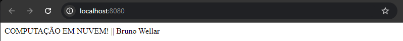

# Criando e Usando um Dockerfile: Passo a Passo

## 1. Criando o Dockerfile

1. Abra seu editor de texto favorito.
2. Crie um novo arquivo chamado `Dockerfile` (sem extensão).
3. Comece a escrever as instruções para construir sua imagem.

## 2. Conteúdo Básico do Dockerfile

### Use uma imagem base
- FROM node:18
### Defina o diretório de trabalho
- WORKDIR /app
#### Copie os arquivos do projeto
- COPY package.json ./
- COPY package-lock.json ./
#### Instale as dependências
- RUN npm install
### Copie o resto dos arquivos
- COPY . .
#### Exponha a porta que o app usa
- EXPOSE 8080
#### Comando para iniciar o app
- CMD ["node", "index.js"]

## 3. Construindo a Imagem

Abra o terminal na pasta do seu Dockerfile e digite:

docker build -t comp-nuvem .

Isso cria uma imagem chamada "comp-nuvem".

## 4. Executando o Container

Para iniciar seu app, digite:

docker run -p 8080:8080 comp-nuvem

Isso inicia o container e conecta a porta 8080 do container à porta 8080 do seu computador.

## 5. Verificando

Abra seu navegador e vá para `http://localhost:8080`. Se tudo deu certo, você verá seu app rodando!

Pronto! Agora você tem seu app rodando em um container Docker.

